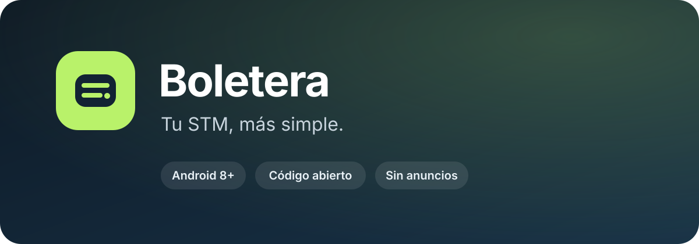
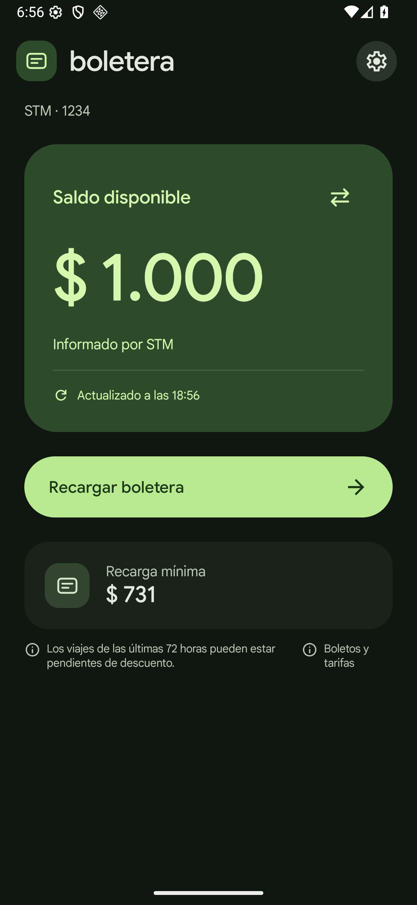

<p align="center">
  
</p>

<p align="center">
  <strong>Consultá tu saldo y recargá tu tarjeta STM desde una app Android clara y nativa.</strong>
</p>

<p align="center">
  <a href="https://github.com/jmestrallet/boletera-android/releases/tag/v0.2.31"><strong>Descargar Boletera</strong></a>
  ·
  <a href="https://github.com/jmestrallet/boletera-android/releases/tag/v0.2.31-beta.1">Probar Boletera Beta</a>
  ·
  <a href="CHANGELOG.md">Ver cambios</a>
</p>

<p align="center">
  
</p>

> [!NOTE]
> Boletera es un proyecto independiente y no oficial. No pertenece a STM, la Intendencia de Montevideo, gub.uy, Prex, Sistarbanc ni BROU.

## Cómo funciona

Boletera no reemplaza a STM ni usa una API paralela. Trabaja sobre el mismo sitio oficial: lo abre por detrás y traduce el recorrido a una interfaz Android más clara, pensada para consultar el saldo y preparar una recarga con menos vueltas.

La app reconoce las pantallas conocidas y automatiza acciones mecánicas, como navegar entre pasos, elegir la boletera y completar campos que ya autorizaste. El ingreso de Usuario gub.uy, los CAPTCHA y la confirmación final del pago siguen bajo tu control. Si STM o un proveedor muestra una pantalla que Boletera no reconoce, el recorrido se detiene.

## Todo lo importante, en un solo lugar

- Saldo disponible y mínimo de recarga informado por STM.
- Selección de boletera, importe y medio de pago.
- Interfaz nativa para el acceso, la recarga y Prex.
- eBROU abierto en Chrome para conservar el entorno del banco.
- Tema claro, oscuro o automático.
- Actualizaciones firmadas desde la propia app.

## Elegí la versión que querés usar

| | **Estable** | **Beta** |
|---|---|---|
| Para quién | Uso habitual | Pruebas y novedades anticipadas |
| Carga Express | No incluida | Experimental |
| Actualizaciones | Sólo versiones estables | Sólo versiones Beta |
| Descarga | [`boletera-0.2.31.apk`](https://github.com/jmestrallet/boletera-android/releases/tag/v0.2.31) | [`boletera-beta-0.2.31-beta.1.apk`](https://github.com/jmestrallet/boletera-android/releases/tag/v0.2.31-beta.1) |

Podés cambiar entre **Estable** y **Beta** desde Configuración. Ambas usan la misma firma y conservan los datos de Boletera al instalar una encima de la otra.

## Instalar

1. Descargá la [última versión estable](https://github.com/jmestrallet/boletera-android/releases/tag/v0.2.31).
2. Abrí el archivo `.apk` en un teléfono con Android 8 o posterior.
3. Si Android lo solicita, permití la instalación desde la app con la que descargaste el archivo.
4. Instalá la actualización encima de la versión anterior para conservar tus datos.

La app puede preparar una recarga real. Revisá siempre el importe y la tarjeta antes de confirmar un pago. Los CAPTCHA y las autorizaciones finales quedan bajo tu control.

## Privacidad y seguridad

- El acceso guardado se cifra con Android Keystore y requiere tu huella para desbloquearse.
- El número de tarjeta, el vencimiento y el CVV no se guardan.
- No hay anuncios, analítica, seguimiento remoto ni un servidor propio.
- La navegación se limita a los sitios verificados de STM, gub.uy y los proveedores de pago.
- Una conexión insegura, una pantalla desconocida o un importe ilegible detienen el recorrido.

La implementación y sus límites están explicados en [Arquitectura](docs/ARQUITECTURA.md), [sesión y versiones](docs/CANALES-Y-SESION-0.2.31.md) e [integración de pagos](docs/INTEGRACION-NATIVA-PAGO.md).

## Estado del proyecto

La app está en desarrollo activo. Se comprobaron recargas reales con Prex, pero cada cambio de STM, gub.uy o Sistarbanc puede exigir una actualización. La versión Beta conserva funciones experimentales que todavía no se recomiendan para el uso habitual.

- [Validación y evidencia](docs/VALIDACION.md)
- [Compatibilidad de pagos](docs/COMPATIBILIDAD-PAGO.md)
- [Historial de cambios](CHANGELOG.md)
- [Cómo probarla en Android](docs/PROBAR-EN-ANDROID.md)

## Compilar

Necesitás JDK 17 o 21, Node.js y Android SDK 35.

```powershell
git clone https://github.com/jmestrallet/boletera-android.git
cd boletera-android
npm ci --ignore-scripts
npm test
./gradlew.bat --no-daemon :app:assembleDebug :app:testDebugUnitTest :app:lintDebug
```

Para generar los APK release con una firma local configurada:

```powershell
./build.ps1                 # Boletera estable
./build.ps1 -Channel beta   # Boletera Beta
```

Las claves de firma y las credenciales locales están excluidas del repositorio.

## Licencia

[MIT](LICENSE). Las marcas y servicios mencionados pertenecen a sus respectivos titulares.
